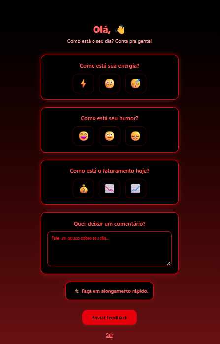
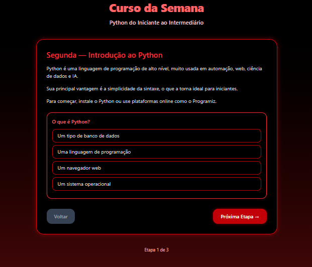

# Motigig

## Descrição

Plataforma de bem‑estar emocional com suporte ao cliente e cursos semanais para desenvolvimento pessoal.

## Status do Projeto

Em desenvolvimento.

## Sumário

* [Sobre o Projeto](#sobre-o-projeto)
* [Tecnologias Utilizadas](#tecnologias-utilizadas)
* [Instalação](#instalação)
* [Como Usar](#como-usar)
* [Estrutura de Pastas](#estrutura-de-pastas)
* [Endpoints ou Rotas Principais](#endpoints-ou-rotas-principais)
* [Screenshots / Demonstração](#screenshots--demonstração)
* [Autores e Créditos](#autores-e-créditos)
* [Contato](#contato)
* [Links](#links)

## Sobre o Projeto

O sistema oferece atendimento de bem‑estar emocional e acesso a cursos semanais. O objetivo é proporcionar suporte acessível com conteúdo contínuo de evolução pessoal.

## Tecnologias Utilizadas

* React
* Vite
* Tailwind CSS
* TypeScript


## Instalação

1. Clone o repositório --> git clone https://github.com/ChallengeFiap1tdspo/global-solution.git
2. Instale as dependências: `npm install`.
3. cd global-solution
5. cd motivagig
6. Inicie o projeto: `npm run dev`.

## Como Usar

1. Acesse a tela inicial.
2. Realize login.
3. Navegue pelos cursos semanais e módulos.
4. Utilize a área de atendimento emocional.

## Estrutura de Pastas

```text
motigig/
│
│
├─ src/
│   ├
│   │
│   ├─ components/             
│   ├─ context/                  
│   ├─ routes/                   
│   │   ├─ Home/
│   │   │   └─ index.tsx
│   │   ├─ Faq/
│   │   │   └─ index.tsx
│   │   ├─ Contato/
│   │   │   └─ index.tsx
│   │   ├─ Equipe/
│   │   │   └─ index.tsx
│   │   ├─ Sobre/
│   │   │   └─ index.tsx
│   │   ├─ Login/
│   │   │   └─ index.tsx
│   │   ├─ Cadastro/
│   │   │   └─ index.tsx
│   │   ├─ Boas-vindas/
│   │   │   └─ index.tsx
│   │   ├─ Curso/
│   │   │   └─ index.tsx
│   │   ├─ Feedback/
│   │   │   └─ index.tsx
│   │   ├─ ProtectedRoute/
│   │   │   └─ index.tsx
│   │   ├─ EditarPerfil/
│   │   │   └─ index.tsx
│   │   ├─ AlterarSenha/
│   │   │   └─ index.tsx
│   │   ├─ DesativarConta/
│   │   │   └─ index.tsx
│   │   └─ Error/
│   │       └─ index.tsx
│   │
│   ├─ types/                    
│   │  
│   │
│   ├─ App.tsx                   
│   ├─ main.tsx                   
│   └─ global.css                 
│
├─ package.json
├─ tsconfig.json
├─ vite.config.ts
└─ README.md

```

## Endpoints ou Rotas Principais

* `/login`
* `/feedback`
* `/curso-semana`
* `/home`


## Screenshots / Demonstração





## Autores e Créditos

* Paulo Estalise RM3811
* Emanuel Italo RM561337
* Alef Rodrigues RM563271
    TODOS DA 1TDSPO

## Contato

Email: [contato@motigig.com](mailto:contato@motigig.com)

## Links

* GitHub: ([Clique e veja o nosso repositorio](https://github.com/ChallengeFiap1tdspo/global-solution.git))
* YouTube:([Assista](https://www.youtube.com/watch?v=bZ8Uqydpbko))
* Vercel: ([clique](https://motivagig.vercel.app/))
